NBS eDNA prelim analyses
================
Kimberly Ledger
2022-11-09

load libraries

``` r
library(tidyverse)
```

    ## ── Attaching packages ─────────────────────────────────────── tidyverse 1.3.2 ──
    ## ✔ ggplot2 3.4.0      ✔ purrr   0.3.5 
    ## ✔ tibble  3.1.8      ✔ dplyr   1.0.10
    ## ✔ tidyr   1.2.1      ✔ stringr 1.4.1 
    ## ✔ readr   2.1.3      ✔ forcats 0.5.2 
    ## ── Conflicts ────────────────────────────────────────── tidyverse_conflicts() ──
    ## ✖ dplyr::filter() masks stats::filter()
    ## ✖ dplyr::lag()    masks stats::lag()

read in taxonomic identification table

``` r
taxons <- read.csv("taxon_table.csv", row.names = 1)
```

filter table to remove Mammalia - this leaves only fish (class ==
Actinopteri)

``` r
taxons <- taxons %>%
  filter(class != "Mammalia")
```

summarize total read count across all samples by taxon

``` r
read_summary <- taxons %>%
  group_by(rank, taxon) %>%
  summarize(sum = sum(c_across(e00611.1:e00683.3))) %>%
  arrange(desc(sum))
```

    ## `summarise()` has grouped output by 'rank'. You can override using the
    ## `.groups` argument.

``` r
head(read_summary, n=20)
```

    ## # A tibble: 20 × 3
    ## # Groups:   rank [6]
    ##    rank        taxon                       sum
    ##    <chr>       <chr>                     <int>
    ##  1 species     Gadus chalcogrammus      489990
    ##  2 species     Clupea pallasii          250669
    ##  3 species     Oncorhynchus tshawytscha 232573
    ##  4 genus       Oncorhynchus             174217
    ##  5 species     Oncorhynchus keta        105283
    ##  6 species     Oncorhynchus kisutch      69327
    ##  7 family      Gadidae                   54982
    ##  8 genus       Ammodytes                 53943
    ##  9 species     Oncorhynchus gorbuscha    53480
    ## 10 genus       Limanda                   40967
    ## 11 suborder    Clupeoidei                34368
    ## 12 species     Gadus macrocephalus       20398
    ## 13 genus       Gadus                     15709
    ## 14 species     Oncorhynchus nerka        12579
    ## 15 no rank     Clupeocephala             10174
    ## 16 family      Pleuronectidae             9569
    ## 17 superfamily Centrarchoidei             7262
    ## 18 species     Micropterus salmoides      5285
    ## 19 species     Cymatogaster aggregata     5282
    ## 20 species     Lumpenus fabricii          4375

read in sample metadata

``` r
meta <- read.csv("NBS_2021_metadata_kjl.csv") %>%
  select(!X) %>%
  arrange(Sample_ID)
```

join metadata to taxons - there’s probably an more succinct way to code
this…

``` r
mytax <- taxons$taxon

nbs.df <- taxons %>%
  select(!taxID:species)

row.names(nbs.df) <- mytax

nbs.df.trans <- data.frame(t(nbs.df))

mysamples <- row.names(nbs.df.trans)

nbs.df.trans$Sample_ID <- mysamples

df <- meta %>%
  left_join(nbs.df.trans, by = "Sample_ID")

head(df)
```

    ##   Sort Extraction_ID Sample_ID Station_ID Depth Sample_blank Extaction_blank
    ## 1  611        e00611  e00611.1          2    10           No              No
    ## 2  611        e00611  e00611.2          2    10           No              No
    ## 3  611        e00611  e00611.3          2    10           No              No
    ## 4  612        e00612  e00612.1          2    10           No              No
    ## 5  612        e00612  e00612.2          2    10           No              No
    ## 6  612        e00612  e00612.3          2    10           No              No
    ##   Sample_Date Ext_Initials  Ext_Date Ext_Plate root Cyprinidae Carassius
    ## 1   8/30/2021           MP 2/23/2022    Jan-22    0          0         0
    ## 2   8/30/2021           MP 2/23/2022    Jan-22    0          0         0
    ## 3   8/30/2021           MP 2/23/2022    Jan-22    0          0         0
    ## 4   8/30/2021           MP 2/23/2022    Jan-22    0          0         0
    ## 5   8/30/2021           MP 2/23/2022    Jan-22    0          0         0
    ## 6   8/30/2021           MP 2/23/2022    Jan-22    0          0         0
    ##   Ictaluridae Ictalurus Ictalurus.punctatus Oncorhynchus Oncorhynchus.gorbuscha
    ## 1           0         0                   0            0                      0
    ## 2           0         0                   0            0                      0
    ## 3           0         0                   0            0                      0
    ## 4           0         0                   0            0                      9
    ## 5           0         0                   0            0                      0
    ## 6           0         0                   0            0                      0
    ##   Oncorhynchus.keta Oncorhynchus.kisutch Oncorhynchus.nerka Gadidae
    ## 1                 0                    0                  0      88
    ## 2                 0                    0                  0       0
    ## 3                 0                    0                  0       0
    ## 4                 0                    0                  0       0
    ## 5                 0                    0                  0       0
    ## 6                 0                    0                  0       0
    ##   Eleginus.gracilis Gadus Cottidae Myoxocephalus Myoxocephalus.scorpius
    ## 1                 0     0        0             0                      0
    ## 2                 0   109        0             0                      0
    ## 3                 0     0        0             0                      0
    ## 4                 0     0        0             0                      0
    ## 5                 0     0        0             0                      0
    ## 6                 0     0        0             0                      0
    ##   Cottioidei Zoarcales Lycodes Pleuronectidae Limanda Hippoglossus
    ## 1          0         0       0              0       0            0
    ## 2          0         0       0              0       0            0
    ## 3          0         0       0              0       0            0
    ## 4          0         0       0              0       0            0
    ## 5          0         0       0              0      17            0
    ## 6          0         0       0              0       0            0
    ##   Micropterus.salmoides Clupea.pallasii Stichaeidae Mallotus.villosus
    ## 1                     0               0           0                 0
    ## 2                     0               0           0                 0
    ## 3                     0               0           0                 0
    ## 4                     0               0           0                 0
    ## 5                     0               0           0                 0
    ## 6                     0               0           0                 0
    ##   Protacanthopterygii Cymatogaster.aggregata Tridentiger Gasterosteus.aculeatus
    ## 1                   0                      0           0                      0
    ## 2                   0                      0           0                      0
    ## 3                   0                      0           0                      0
    ## 4                   0                      0           0                      0
    ## 5                   0                      0           0                      0
    ## 6                   0                      0           0                      0
    ##   Hexagrammos Oncorhynchus.tshawytscha Gadus.macrocephalus Ammodytes Pungitius
    ## 1           0                        0                   0         0         0
    ## 2           0                        0                   0         0         0
    ## 3           0                        0                   0         0         0
    ## 4           0                        0                   0         0         0
    ## 5           0                        0                   0         0         0
    ## 6           0                        0                   0      1940         0
    ##   Syngnathus.leptorhynchus Actinopteri Clupeocephala Characiphysae
    ## 1                        0           0             0             0
    ## 2                        0           0             0             0
    ## 3                        0           0             0             0
    ## 4                        0           0             0             0
    ## 5                        0           0             7             0
    ## 6                        0           0             0             0
    ##   Anoplopoma.fimbria Artedius.fenestralis Nautichthys.pribilovius
    ## 1                  0                    0                       0
    ## 2                  0                    0                       0
    ## 3                  0                    0                       0
    ## 4                  0                    0                       0
    ## 5                  0                    0                       0
    ## 6                  0                    0                       0
    ##   Ammodytes.hexapterus Osmerus.mordax.dentex Gobionellinae Lycodinae
    ## 1                    0                     0             0         0
    ## 2                    0                     0             0         0
    ## 3                    0                     0             0         0
    ## 4                    0                     0             0         0
    ## 5                    0                     0             0         0
    ## 6                    0                     0             0         0
    ##   Pleuronectes.quadrituberculatus Lumpenus.fabricii Gadus.chalcogrammus
    ## 1                               0                 0                1737
    ## 2                               0                 0                1776
    ## 3                               0                 0                   0
    ## 4                               0                 0                  18
    ## 5                               0                 0                   0
    ## 6                               0                 0                3071
    ##   Clupeoidei Stomiatii Gadoidei Percomorphaceae Eupercaria Cottales
    ## 1          0         0        0               0          0        0
    ## 2          0         0        0               0          0        0
    ## 3          0         0        0               0          0        0
    ## 4          0         0        0               0          0        0
    ## 5          0         0        0               0          0        0
    ## 6          0         0        0               0          0        0
    ##   Centrarchoidei Pungitius.sp..Brackish.type
    ## 1              0                           0
    ## 2              0                           0
    ## 3              0                           0
    ## 4              0                           0
    ## 5              0                           0
    ## 6              0                           0

## first, let’s take a look at the extraction blanks

``` r
ext.blanks <- df %>%
  filter(Extaction_blank == "Yes") 

ext.blank.taxon <- ext.blanks%>%
  select(!Sort:Extraction_ID) %>%
  select(!Station_ID:Ext_Plate)

#pivot longer 
ext.blank.taxon.long <- ext.blank.taxon %>%
  pivot_longer(cols = 2:59, names_to = "taxon", values_to = "reads") %>%
  filter(reads != 0)

ext.blank.taxon.long %>%
  ggplot(aes(x=Sample_ID, y=reads, fill=taxon)) +
  geom_bar(stat = "identity") + 
  scale_y_sqrt() +
  theme_bw() +
  labs(
    y = "sequencing reads",
    x = "sample",
    title = "NBS extraction blanks")
```

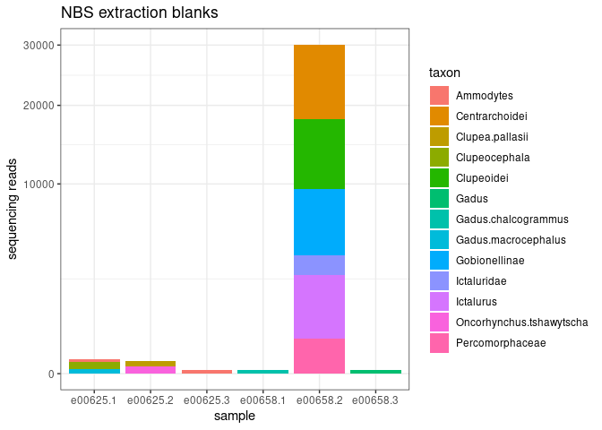<!-- -->

well something went wrong with e00658.2…

## second, let’s take a look at the sample blanks (these were the blank samples taken in the field)

``` r
samp.blanks <- df %>%
  filter(Sample_blank == "Yes") 

station.id <- data.frame(samp.blanks$Sample_ID, samp.blanks$Station_ID)
colnames(station.id) <- c("Sample_ID", "Station_ID")

samp.blank.taxon <- samp.blanks%>%
  select(!Sort:Extraction_ID) %>%
  select(!Station_ID:Ext_Plate)

#pivot longer 
samp.blank.taxon.long <- samp.blank.taxon %>%
  pivot_longer(cols = 2:59, names_to = "taxon", values_to = "reads") %>%
  filter(reads != 0)

#plot with sample ID
# samp.blank.taxon.long %>%
#   ggplot(aes(x=Sample_ID, y=reads, fill=taxon)) +
#   geom_bar(stat = "identity") + 
#   #scale_y_sqrt() +
#   theme_bw() +
#   labs(
#     y = "sequencing reads",
#     x = "sampleID",
#     title = "NBS sample blanks") +
#   theme(
#     axis.text.x = element_text(angle = 90, hjust = 0.95),
#     legend.text = element_text(size = 8),
#     legend.key.size = unit(0.3, "cm"),
#     legend.position = "bottom",
#     legend.title = element_blank()
#   )
  
#plot sample blanks combined by station ID
samp.blank.taxon.long.station <- samp.blank.taxon.long %>%
  left_join(station.id, by = "Sample_ID")

samp.blank.taxon.long.station$Station_ID <- as.factor(samp.blank.taxon.long.station$Station_ID)
  
# samp.blank.taxon.long.station %>%
#   ggplot(aes(x=Station_ID, y=reads, fill=taxon)) +
#   geom_bar(stat = "identity") + 
#   #scale_y_sqrt() +
#   theme_bw() +
#   labs(
#     y = "sequencing reads",
#     x = "stationID",
#     title = "NBS sample blanks") +
#   theme(
#     legend.text = element_text(size = 8),
#     legend.key.size = unit(0.3, "cm"),
#     legend.position = "bottom",
#     legend.title = element_blank()
#   )

#plot sample blanks with both stationID and sampleID info
col_order <- c("Station_ID", "Sample_ID", "taxon", "reads")
samp.blank.taxon.long.station <- samp.blank.taxon.long.station[, col_order]

samp.blank.taxon.long.station %>%
  unite("X", Station_ID:Sample_ID) %>%
  ggplot(aes(x=X, y=reads, fill=taxon)) +
  geom_bar(stat = "identity") + 
  #scale_y_sqrt() +
  theme_bw() +
  labs(
    y = "sequencing reads",
    x = "stationID_sampleID",
    title = "NBS sample blanks") +
  theme(
    axis.text.x = element_text(angle = 90, hjust = 0.95),
    legend.text = element_text(size = 8),
    legend.key.size = unit(0.3, "cm"),
    legend.position = "bottom",
    legend.title = element_blank()
  )
```

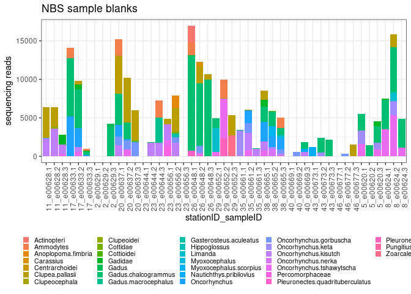<!-- -->

how do we deal with many reads in samples that should be blanks…?

## now let’s look at the field samples

start by making a df that will be easy to plot different combos of
metadata

``` r
field <- df %>%
  filter(Extaction_blank == "No") %>%
  filter(Sample_blank == "No") 

field.taxon <- field %>%
  select(!Sort:Extraction_ID) %>%
  select(!Station_ID:Ext_Plate) %>%
  pivot_longer(cols = 2:59, names_to = "taxon", values_to = "reads") %>%
  filter(reads != 0)

field.meta <- field %>%
  select(Station_ID, Depth, Extraction_ID, Sample_ID) %>%
  unite("Station_Depth", Station_ID:Depth, remove = FALSE) %>%
  unite("Station_Depth_Ext", Station_ID:Extraction_ID, remove = FALSE) %>%
  unite("Station_Depth_Ext_Samp", Station_ID:Sample_ID, remove = FALSE)
# all these combo is probably excessive... but just being safe for now. 

field.df <- field.taxon %>%
  left_join(field.meta, by = "Sample_ID")

field.df$Station_ID <- as.factor(field.df$Station_ID)
field.df$Depth <- as.factor(field.df$Depth)
```

### plot all samples

``` r
#plot with sample ID
field.df %>%
  ggplot(aes(x=Sample_ID, y=reads, fill=taxon)) +
  geom_bar(stat = "identity") + 
  #scale_y_sqrt() +
  theme_bw() +
  labs(
    y = "sequencing reads",
    x = "sampleID",
    title = "NBS field samples") +
  theme(
    axis.text.x = element_text(angle = 90, hjust = 0.95),
    legend.text = element_text(size = 8),
    legend.key.size = unit(0.3, "cm"),
    legend.position = "bottom",
    legend.title = element_blank()
  )
```

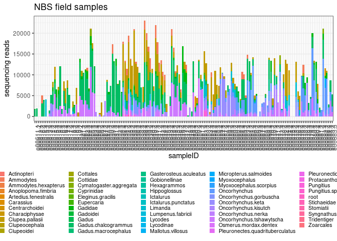<!-- -->

### most sites just had samples collected at 10m depth, so let’s keep only 10m sample and combine by station

``` r
field.df %>%
  filter(Depth == 10) %>%
  ggplot(aes(x=Station_ID, y=reads, fill=taxon)) +
  geom_bar(stat = "identity") + 
  #scale_y_sqrt() +
  theme_bw() +
  labs(
    y = "sequencing reads",
    x = "stationID",
    title = "NBS field samples by station")  +
  theme(
    legend.text = element_text(size = 8),
    legend.key.size = unit(0.3, "cm"),
    legend.position = "bottom",
    legend.title = element_blank()
  )
```

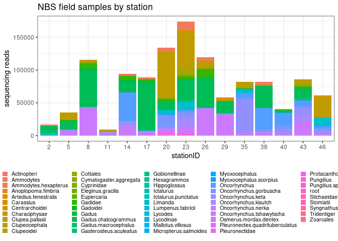<!-- -->

**note that station 23 had twice as many samples (18) from 10m as the
others (9) and station 11 had less (6)** this plot is not standardized
by sample number

### let’s take a closer look at the variation within a station

i’m randomly choosing station 8 for now

``` r
field.df %>%
  filter(Station_ID == "8") %>%
  ggplot(aes(x=Sample_ID, y=reads, fill=taxon)) +
  geom_bar(stat = "identity") + 
  #scale_y_sqrt() +
  theme_bw() +
  labs(
    y = "sequencing reads",
    x = "sampleID",
    title = "NBS field samples - Station 8")  +
  theme(
    legend.text = element_text(size = 8),
    legend.key.size = unit(0.3, "cm"),
    legend.position = "bottom",
    legend.title = element_blank()
  )
```

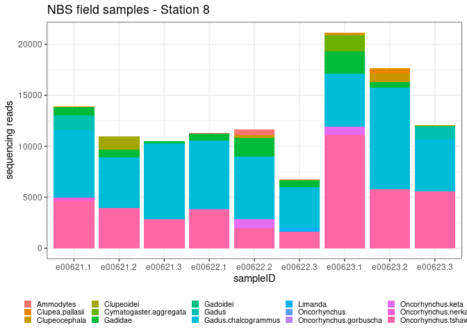<!-- -->

### let’s compare samples taken at different depth

start with station 5

``` r
field.df %>%
  filter(Station_ID == "5") %>%
  ggplot(aes(x=Station_Depth_Ext_Samp, y=reads, fill=taxon)) +
  geom_bar(stat = "identity") + 
  #scale_y_sqrt() +
  theme_bw() +
  labs(
    y = "sequencing reads",
    x = "stationID_depth_extractionID_sampleID",
    title = "NBS field samples - Station 5")  +
  theme(
    axis.text.x = element_text(angle = 90, hjust = 0.95),
    legend.text = element_text(size = 8),
    legend.key.size = unit(0.3, "cm"),
    legend.position = "bottom",
    legend.title = element_blank()
  )
```

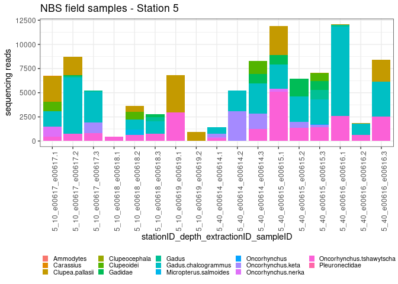<!-- -->

``` r
field.df %>%
  filter(Station_ID == "5") %>%
  ggplot(aes(x=Depth, y=reads, fill=taxon)) +
  geom_bar(stat = "identity") + 
  #scale_y_sqrt() +
  theme_bw() +
  labs(
    y = "sequencing reads",
    x = "Depth",
    title = "NBS field samples - Station 5")  +
  theme(
    axis.text.x = element_text(angle = 90, hjust = 0.95),
    legend.text = element_text(size = 8),
    legend.key.size = unit(0.3, "cm"),
    legend.position = "bottom",
    legend.title = element_blank()
  )
```

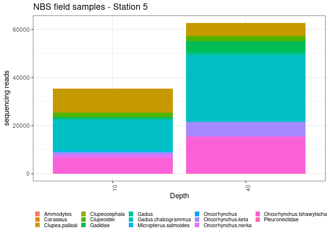<!-- -->

now with station 14

``` r
field.df %>%
  filter(Station_ID == "14") %>%
  ggplot(aes(x=Station_Depth_Ext_Samp, y=reads, fill=taxon)) +
  geom_bar(stat = "identity") + 
  #scale_y_sqrt() +
  theme_bw() +
  labs(
    y = "sequencing reads",
    x = "stationID_depth_extractionID_sampleID",
    title = "NBS field samples - Station 14")  +
  theme(
    axis.text.x = element_text(angle = 90, hjust = 0.95),
    legend.text = element_text(size = 8),
    legend.key.size = unit(0.3, "cm"),
    legend.position = "bottom",
    legend.title = element_blank()
  )
```

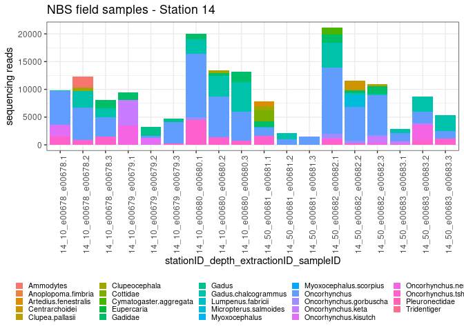<!-- -->

``` r
field.df %>%
  filter(Station_ID == "14") %>%
  ggplot(aes(x=Depth, y=reads, fill=taxon)) +
  geom_bar(stat = "identity") + 
  #scale_y_sqrt() +
  theme_bw() +
  labs(
    y = "sequencing reads",
    x = "Depth",
    title = "NBS field samples - Station 14")  +
  theme(
    axis.text.x = element_text(angle = 90, hjust = 0.95),
    legend.text = element_text(size = 8),
    legend.key.size = unit(0.3, "cm"),
    legend.position = "bottom",
    legend.title = element_blank()
  )
```

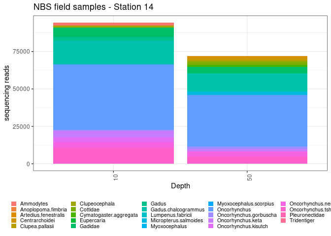<!-- -->

and station 23

``` r
field.df %>%
  filter(Station_ID == "23") %>%
  ggplot(aes(x=Station_Depth_Ext_Samp, y=reads, fill=taxon)) +
  geom_bar(stat = "identity") + 
  #scale_y_sqrt() +
  theme_bw() +
  labs(
    y = "sequencing reads",
    x = "stationID_depth_extractionID_sampleID",
    title = "NBS field samples - Station 23")  +
  theme(
    axis.text.x = element_text(angle = 90, hjust = 0.95),
    legend.text = element_text(size = 8),
    legend.key.size = unit(0.3, "cm"),
    legend.position = "bottom",
    legend.title = element_blank()
  )
```

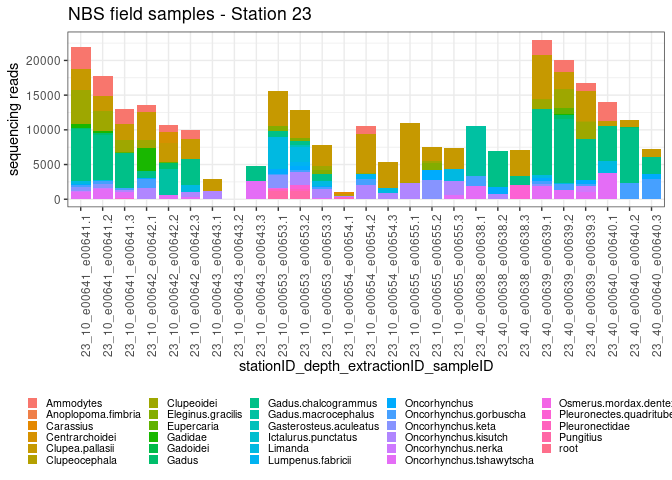<!-- -->

``` r
field.df %>%
  filter(Station_ID == "23") %>%
  ggplot(aes(x=Depth, y=reads, fill=taxon)) +
  geom_bar(stat = "identity") + 
  #scale_y_sqrt() +
  theme_bw() +
  labs(
    y = "sequencing reads",
    x = "Depth",
    title = "NBS field samples - Station 23")  +
  theme(
    axis.text.x = element_text(angle = 90, hjust = 0.95),
    legend.text = element_text(size = 8),
    legend.key.size = unit(0.3, "cm"),
    legend.position = "bottom",
    legend.title = element_blank()
  )
```

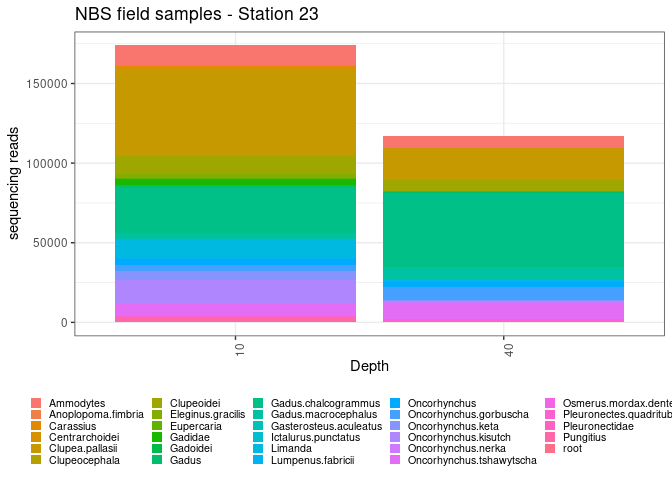<!-- -->

**twice as many samples taken from 10m as from 40m**

## now let’s group by location

``` r
field.df.groups <- field.df %>%
  mutate(group = ifelse(Station_ID == 46, "norton", NA)) %>%
    mutate(group = ifelse(Station_ID %in% c(32,43), "inshore.north", group)) %>%
      mutate(group = ifelse(Station_ID %in% c(38,40,35), "offshore.north", group)) %>%
        mutate(group = ifelse(Station_ID %in% c(20,29), "inshore.yukon", group)) %>%
         mutate(group = ifelse(Station_ID %in% c(17,23,26), "offshore.yukon", group)) %>%
           mutate(group = ifelse(Station_ID %in% c(8,11), "inshore.south", group)) %>%
              mutate(group = ifelse(Station_ID %in% c(2,5,14), "offshore.south", group))
```

``` r
field.df.groups %>%
  filter(Depth == 10) %>%
  ggplot(aes(x=Station_ID, y=reads, fill=taxon)) +
  geom_bar(stat = "identity") + 
  facet_grid(cols = vars(group), scales = "free", space = "free") +
  #scale_y_sqrt() +
  theme_bw() +
  labs(
    y = "sequencing reads",
    x = "station location",
    title = "NBS field samples")  +
  theme(
    axis.text.x = element_text(angle = 90, hjust = 0.95),
    legend.text = element_text(size = 8),
    legend.key.size = unit(0.3, "cm"),
    legend.position = "bottom",
    legend.title = element_blank()
  )
```

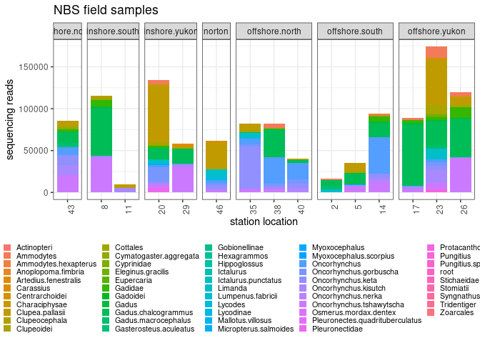<!-- -->
